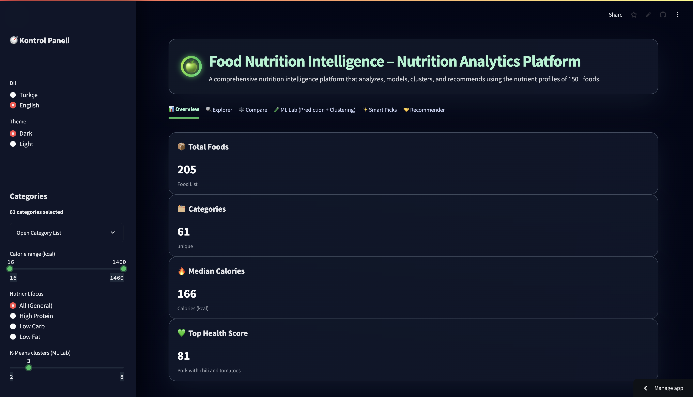
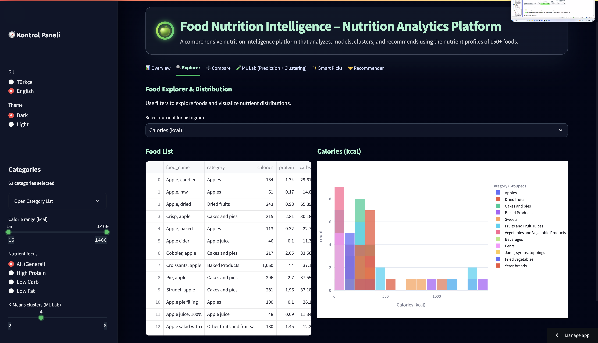
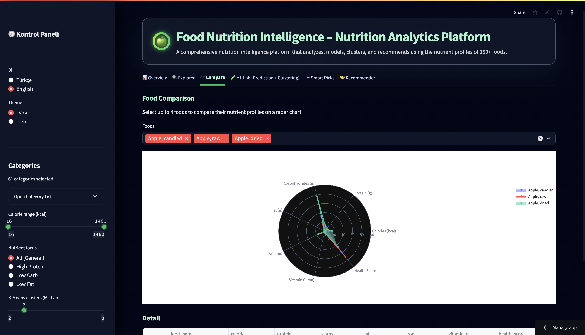
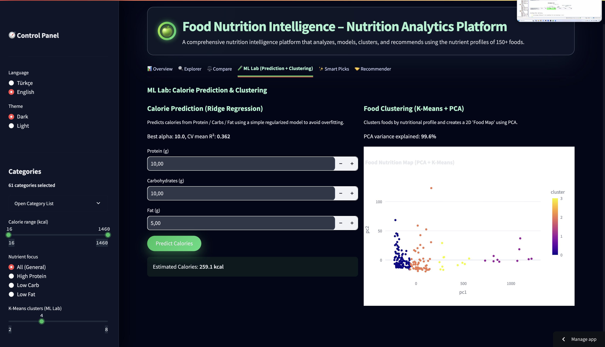

# 🍏 Food Nutrition Intelligence
### **AI-Powered Nutrition Intelligence Platform**  
*A modern, interactive platform for analyzing, modeling, clustering, and recommending foods using nutrition data.*

<p align="center">
  
</p>

---

# 🌐 Live Demo  
👉 https://food-nutrition-intelligence.streamlit.app/

# 📊 Dataset  
👉 https://www.kaggle.com/datasets/henryshan/food-nutrition-dataset

# 🎥 Demo Video  
Located in `media/Demo-Video.mp4`

---

# 📑 Table of Contents
- [Overview](#overview-en)
- [Scientific Foundation](#scientific-foundation-en)
- [Key Features](#key-features-en)
- [Architecture](#project-architecture-en)
- [Screenshots](#screenshots-en)
- [Results](#results-en)
- [Use Cases](#use-cases-en)
- [Tech Stack](#tech-stack-en)
- [Installation](#installation-en)
- [Author](#author-en)
- [Turkish Version](#🇹🇷-türkçe-versiyon)
- [References](#📚-references--kaynakça)

---

# 📌 Overview (EN)

**Food Nutrition Intelligence** is an interactive nutrition analytics platform analyzing nutrient profiles of **150+ everyday foods**, providing:

- Scientifically grounded calorie prediction  
- Nutrient-based clustering & PCA-powered 2D Food Map  
- Intelligent food similarity & recommendation engine  
- Smart Picks (high-protein, low-calorie, vitamin-rich lists)  
- Bilingual TR/EN interface  
- Modern UI with dark/light themes  

---

# 📚 Scientific Foundation (EN)

This project aligns with:

**Rüede et al. (2020)**  
*Multi-Task Learning for Calorie Prediction on a Novel Large-Scale Recipe Dataset Enriched with Nutritional Information.*

Key insights:

- Macronutrients = strongest predictors of calorie content  
- Single-task calorie models → **R² ≈ 0.30–0.40**  
- Multi-task & ingredient-level modeling improves accuracy  
- Nutrition data has **low-dimensional structure** (PCA)

➡️ This project’s Ridge Regression model achieved **CV R² = 0.36**, matching the scientific accuracy range.

---

# 🧠 Key Features (EN)

### ✔ **1. Calorie Prediction**
Predicts calories from protein, carbs, and fats using Ridge Regression.

### ✔ **2. PCA + Clustering**
- PCA explains **99.6% variance**  
- Natural nutrient clusters visualized in 2D

### ✔ **3. Recommendation Engine**
Cosine similarity recommends nutritionally similar foods.

### ✔ **4. Smart Picks**
- High protein  
- Low calorie  
- High Vitamin C  
- High iron  

### ✔ **5. Modern UI**
- Light/Dark theme  
- TR/EN bilingual  

---

# 🏗 Project Architecture (EN)

```
Food Nutrition Intelligence
├── Data Layer
│   ├── USDA-based Kaggle dataset
│   └── Cleaning & normalization
│
├── Machine Learning
│   ├── Calorie Model (Ridge Regression)
│   ├── PCA (2D reduction)
│   ├── K-Means clustering
│   └── Cosine similarity recommendation engine
│
├── Visualization
│   ├── Plotly interactive charts
│   ├── 2D Food Map
│   └── Radar comparison charts
│
└── Streamlit UI
    ├── Explorer
    ├── Compare
    ├── ML Lab
    └── Recommendation
```

---

# 🖼 Screenshots (EN)

<p align="center"></p>
<p align="center"></p>
<p align="center"></p>
<p align="center"></p>
<p align="center"></p>

---

# 📊 Results (EN)

### **Calorie Model**
- CV R²: **0.36**  
- Matches scientific expectations (0.30–0.40)

### **PCA**
- Explained variance: **99.6%**

### **Clustering**
- Natural groupings: fruits, meats, snacks, bakery items  
---

# 💡 Use Cases (EN)

- Diet planning  
- Food comparison  
- Recipe development  
- Healthy alternative discovery  
- Nutrition education  
- FMCG & food analytics  

---

# 🛠 Tech Stack (EN)

- Python  
- Streamlit  
- Pandas  
- NumPy  
- scikit-learn  
- Plotly  
- PCA / K-Means  
- Cosine Similarity  

---

# ⚙ Installation (EN)

```bash
pip install -r requirements.txt
streamlit run app.py
```

---

# 👤 Author (EN)

**Özge Güneş**

---

# 🇹🇷 Türkçe Versiyon

# 🍏 Food Nutrition Intelligence — Besin Zekâsı Platformu

🌐 Canlı Demo:  
https://food-nutrition-intelligence.streamlit.app/

📊 Veri Seti:  
https://www.kaggle.com/datasets/henryshan/food-nutrition-dataset

🎥 Demo Videosu:  
`media/Demo-Video.mp4`

---

# 📌 Genel Bakış (TR)

Food Nutrition Intelligence, **150+ gün­­lük gıdanın besin profillerini** analiz eden modern bir besin analitiği platformudur.

- Bilimsel kalori tahmini  
- PCA + K‑Means ile 2D Besin Haritası  
- Benzer gıda öneri sistemi  
- Smart Picks (yüksek protein, düşük kalori vb.)  
- TR/EN arayüz  
- Modern tema desteği  

---

# 📚 Bilimsel Temel (TR)

Proje şu çalışmaya dayanmaktadır:

**Rüede ve ark. (2020)**  
*Multi-Task Learning for Calorie Prediction…*

Öne çıkan bulgular:

- Makro besinler kalorinin en güçlü belirleyicisidir  
- Tek görevli modellerde doğruluk **R² ≈ %30–40**  
- Ridge Regression modeli **CV R² = %36**  
→ Bilimsel doğrulukla uyumludur  

---

# 🧠 Temel Özellikler (TR)

### ✔ **Kalori Tahmini**
Protein / Karbonhidrat / Yağ’dan kalori tahmini

### ✔ **PCA + Kümeleme**
%99.6 varyans açıklama

### ✔ **Öneri Motoru**
Cosine similarity ile benzer besin bulma

### ✔ **Smart Picks**
Yüksek protein, düşük kalori vb.

### ✔ **Modern Arayüz**
TR/EN destekli  

---

# 🏗 Proje Mimarisi (TR)

```
Food Nutrition Intelligence
├── Veri Katmanı
│   ├── USDA tabanlı Kaggle veri seti
│   └── Temizleme & normalizasyon
│
├── Makine Öğrenimi
│   ├── Kalori Modeli (Ridge Regression)
│   ├── PCA (2 boyut indirgeme)
│   ├── K-Means kümeleme
│   └── Cosine similarity öneri motoru
│
├── Görselleştirme
│   ├── Plotly grafikler
│   ├── 2D Besin Haritası
│   └── Radar karşılaştırmalar
│
└── Streamlit UI
    ├── Explorer
    ├── Compare
    ├── ML Lab
    └── Recommendation
```

---

# 📚 **References / Kaynakça**

Rüede, R., Heusser, V., Frank, L., Roitberg, A., Haurilet, M., & Stiefelhagen, R. (2020).  
*Multi-Task Learning for Calorie Prediction on a Novel Large-Scale Recipe Dataset Enriched with Nutritional Information.*  
arXiv:2011.01082

---

